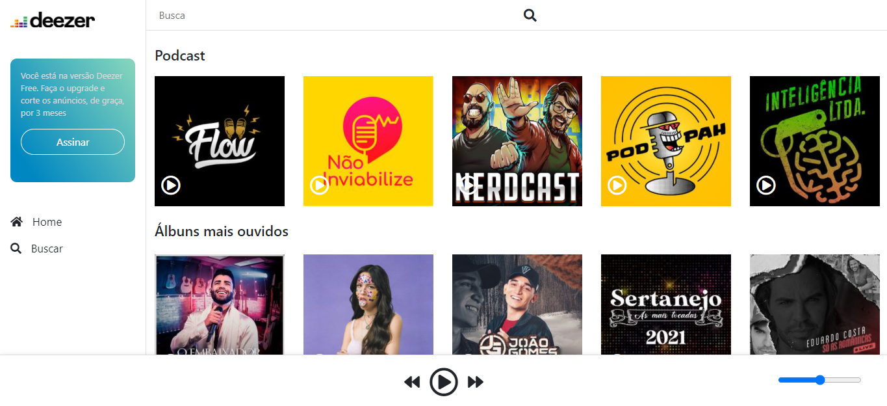
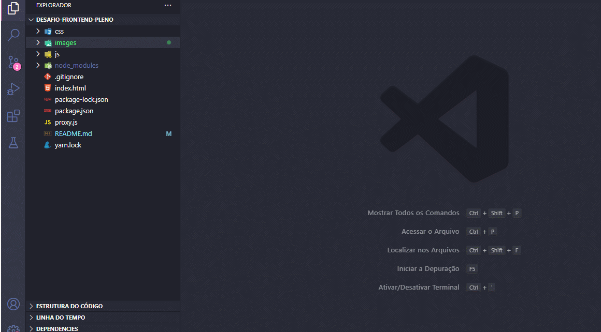

# 💻💖 TOTVS PI

Esse é o desafio que foi prosposto para a vaga de Analista / Desenvolvedor Pleno, os requisitos do sistema estão descritos abaixo.

- [JQuery](https://jquery.com/)
- [Bootstrap 5](https://getbootstrap.com/docs/5.0/getting-started/introduction/)
- [Fetch](https://developer.mozilla.org/pt-BR/docs/Web/API/Fetch_API/Using_Fetch)
- [CSS](https://developer.mozilla.org/pt-BR/docs/Web/CSS)

## Imagem final do projeto

## Como executar o projeto

### Instalação dos pacotes
Digite o comando abaixo para instalar os pacotes

    npm install

O Visual Studio Code possui uma extensão chamada Live Server, instale ela seguindo os passos abaixo.

Caso você não possua o Visual Studio Code você pode iniciar qualquer servidor dentro da pasta. O exemplo abaixo mostra como seria com php.

    php -S localhost:8000

Após esses passos o front-end está pronto, agora iniciar o serviço da Api. Digite o comando abaixo para iniciar a Api.
    
    yarn proxy

